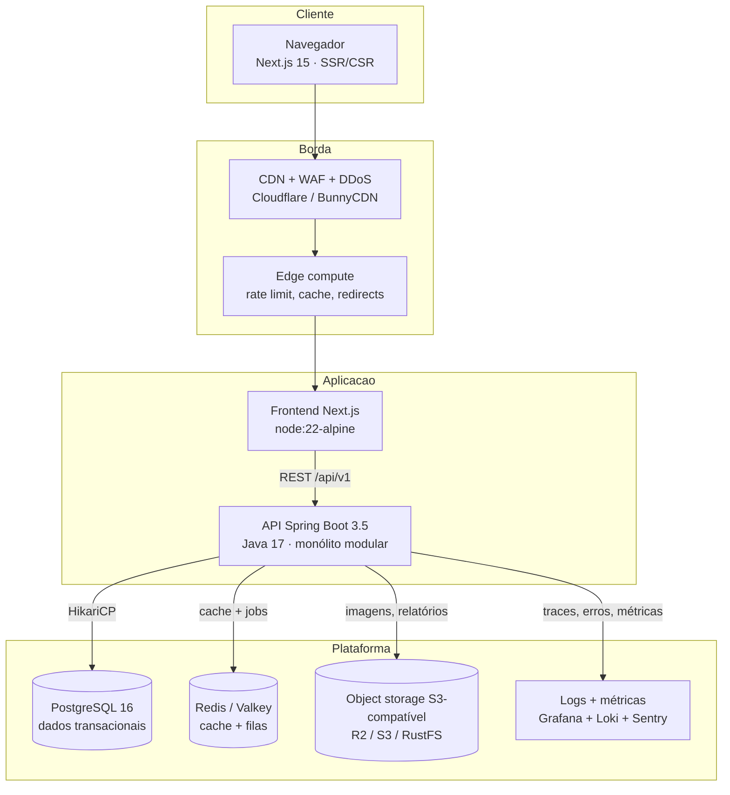
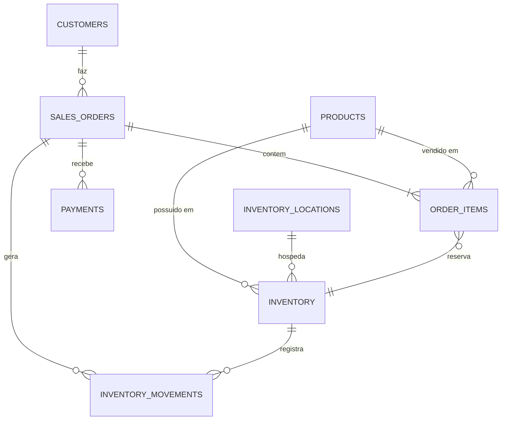
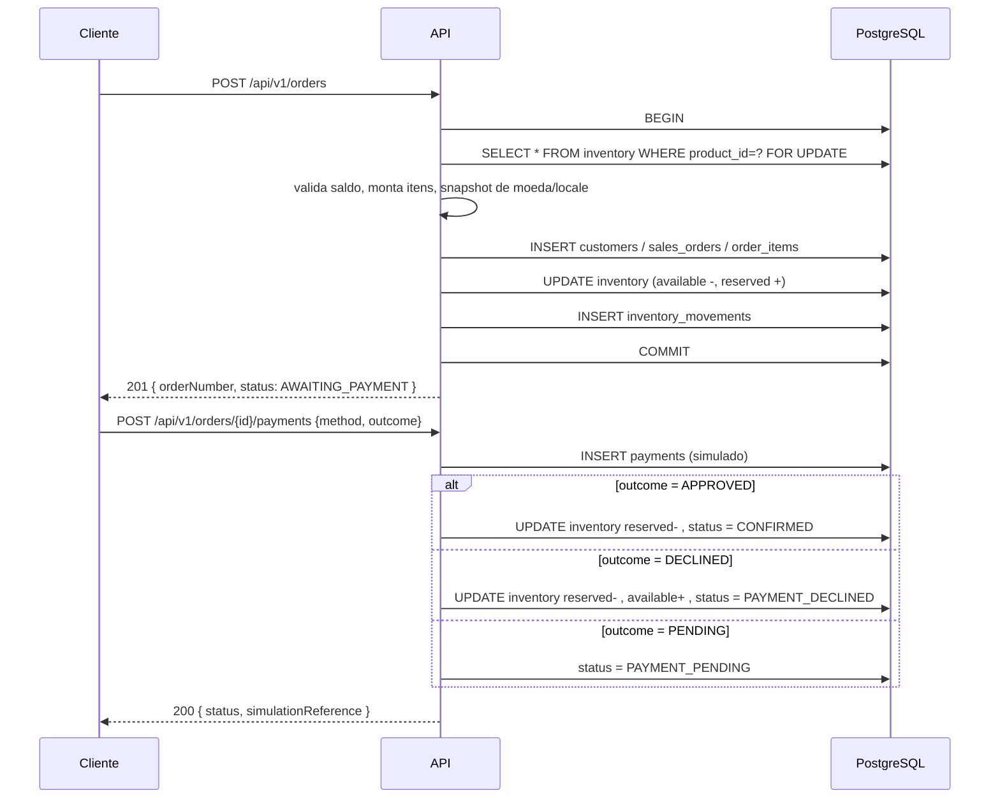
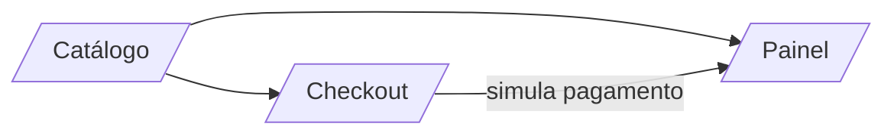

# Tradewind — Arquitetura (projeto acadêmico, fictício)

Documento de referência do repositório. Descreve a stack escolhida, as alternativas
descartadas, o modelo de dados, os fluxos e o plano de implantação. Pagamento é
**sempre simulado** — não há gateway, cartão, PIX real ou dado bancário em lugar
nenhum do código.

## 1. Diagrama da arquitetura



Uma única aplicação Spring Boot, não microsserviços. A razão está na seção 9:
o gargalo real é o banco, e separar o checkout em rede só adicionaria latência e
modo de falha.

## 2. Stack tecnológica

| Camada | Escolha | Versão testada na máquina |
| --- | --- | --- |
| API | Spring Boot (Web, Validation, Data JPA, Actuator) | 3.5.3 |
| Runtime API | Eclipse Temurin JRE | 17.0.20.1 (`.tools/`) |
| Banco | PostgreSQL | 16-alpine (Docker 29.5.2) |
| Migração | Flyway | 11.7.2 (via BOM do Boot) |
| Documentação | springdoc-openapi | 2.8.6 |
| Frontend | Next.js App Router + React | 15.1.6 / 19.0.0 |
| Build frontend | Node + TypeScript | 24.16.0 / 12.0.2 / TS 5.7.3 |
| Testes | JUnit 5, Mockito 5, MockMvc, Testcontainers | Boot BOM / TC 1.20.6 |
| Cache/filas | Redis 7 (ou Valkey) | 7-alpine (Docker 29.5.2) |
| Armazenamento de arquivos | Object storage S3-compatível (RustFS local, R2/S3 em produção) | rustfs/rustfs:latest |
| Observabilidade | Actuator + Prometheus + Grafana | Boot 3.5.3 / prom v3.1.0 / grafana 12.0.1 |
| CI | GitHub Actions | — |

### Por que Java 17 e não o 11 instalado

`java -version` na máquina devolve `openjdk 11.0.16.1`. O `pom.xml` compila com
`<java.version>17</java.version>` e o Spring Boot 3 **exige 17+**. `scripts/setup.ps1`
baixa o Temurin 17 para `.tools/` sem instalar no sistema e sem pedir admin — é o
caminho suportado. Trocar o projeto para Java 11 exigiria descer para o Spring Boot
2.7 (fora de suporte), não vale.

## 3. Comparação de ferramentas (3 alternativas por função)

### 3.1 Hospedagem da API

| Critério | Fly.io | Railway | DigitalOcean (App Platform) |
| --- | --- | --- | --- |
| Vantagens | Multi-region, health checks, escala horizontal por região, `fly deploy` rápido | Zero-config, preview por PR, banco incluso | Preço previsível, droplets com IP público, documentada |
| Limitações | Sem porta 443 sem proxy, cobrança por banda alta | Plano hobby limitado a ~500 h/mês, vendor lock moderado | Sem auto-scale nativo (Droplet + LB) |
| Escalabilidade | Excelente, multi-region real | Boa, vertical e horizontal | Manual |
| Segurança | Firewall nativo, TLS no proxy | TLS gerenciado | Firewall cloud + LB |
| Integração | Docker/Procfile, GitHub Actions oficial | Git, CLI, API | API + Terraform |
| Manutenção | Simples | Muito simples | Exige mais trabalho ops |
| Custo (acadêmico) | ~US$5–15/mês | ~US$5–20/mês | ~US$6–24/mês |
| Disponibilidade regional | 4+ regiões próximas (GRU, MAD, ORD, SYD) | Poucos datacenters | Ampla |
| Lock-in | Médio (imagem Docker + config em arquivo) | Médio | Baixo |
| Adequação internacional | **Alta** | Média | Média |

**Escolhido: DigitalOcean Droplet + Cloudflare no proxy.** Racional: é o único dos
três em que o plano de crescimento não muda de modelo mental. Um Droplet de US$6
(1 GB, com swap e Postgres na mesma máquina, apenas para o projeto acadêmico) roda
frontend e API; quando o custo importar mais que a dor de manutenção, o mesmo
Dockerfile sobe no Fly sem tocar em código. Custo previsível é o que uma projeto
sem receita precisa.

### 3.2 Banco de dados

| Critério | Neon | PlanetScale | Postgres gerenciado (DO/RDS) |
| --- | --- | --- | --- |
| Vantagens | Branch de banco por PR, scale-to-zero, pooling nativo | Vitess, escala horizontal enorme | SQL completo, extensões, `FOR UPDATE`, backups automáticos, PITR |
| Limitações | cold start, só Postgres serverless, limites de compute | **MySQL/Vitess**: sem `PESSIMISTIC_WRITE` igual, DDL restrito, preço por IO | Não escala sozinho, exige um planejador |
| Escalabilidade | Vertical + scale-to-zero | Horizontal sharding | Vertical + réplicas de leitura |
| Segurança | SSL obrigatório, pooled user separado | SSO, private link | SSL, firewall, IAM do provedor |
| Integração | JDBC direto, Flyway nativo | JDBC com proxy | JDBC direto |
| Manutenção | Simples (branch = teste isolado) | Simples na API, complexa no schema | Simples |
| Custo | ~US$0–19/mês | ~US$0–50/mês | ~US$15–60/mês |
| Regional | US e Europa (São Paulo sob consulta) | US/UE | Ampla |
| Lock-in | Médio | **Alto** (dialect MySQL) | Baixo |
| Adequação | **Alta** | Baixa para este domínio | Alta |

**Escolhido: PostgreSQL 16 (Docker Compose local, gerenciado em produção).**
Dois motivos técnicos, não de gosto: (1) o checkout usa
`SELECT ... FOR UPDATE` em `inventory` para impedir oversell — em MySQL/Vitess a
semântica de locking e gap lock muda e o padrão deixa de ser portátil;
(2) extensões como `pg_trgm` (busca textual), `citext` e `pgcrypto` são usadas
direto. Neon seria a alternativa obrigatória se o projeto precisasse de banco
serverless com branch por PR.

### 3.3 Cache e filas

| Critério | Upstash Redis | Redis gerenciado (DO) | KeyDB / Dragonfly |
| --- | --- | --- | --- |
| Vantagens | HTTP simples, sem conexão persistente, free tier generoso | `redis-cli`, Lua, streams, padrão conhecido | Drop-in do Redis, mais throughput |
| Limitações | Latência de rede por comando, sem pub/sub frio confiável, custo por requisição | Precisa gerenciar | Menos ecosystems |
| Escalabilidade | Vertical | Vertical + cluster | Vertical |
| Segurança | TLS, token por requisição | TLS + ACL | TLS |
| Integração | Spring Data Redis ou cliente HTTP | Spring Data Redis | Spring Data Redis |
| Manutenção | Muito simples | Simples | Simples |
| Custo | ~US$0–10/mês | ~US$15/mês | ~US$15/mês |
| Regional | Edge(global) | Datacenter fixo | Datacenter fixo |

**Escolhido: Redis/Valkey autohospedado ou gerenciado, via Spring Data Redis.**
O padrão `KEYS`-free com TTL e o cache de catálogo é simples o bastante para que
qualquer um dos três sirva; Valkey entra porque é Apache 2.0 e não muda uma linha
de código em relação ao Redis. **Importante:** cache e fila são *opcionais*. Se o
Redis cair, o sistema continua vendendo — o checkout depende só do Postgres.

### 3.4 Armazenamento de objetos

| Critério | Cloudflare R2 | Amazon S3 | S3-compatível autohospedado (RustFS) |
| --- | --- | --- | --- |
| Vantagens | Sem custo de egress, API S3 | Madura, 99,999…%, região global | Idêntico à API S3, controle total, sobe em 5 s |
| Limitações | Operação da Cloudflare | Egress caro | Operação própria, sem CDN nativo |
| Escalabilidade | Elástica | Elástica | Vertical |
| Segurança | Token, bucket privado, URL assinada | IAM + URL assinada + KMS | Credencial própria, bucket privado |
| Integração | SDK S3 | SDK S3 | SDK S3 |
| Manutenção | Baixa | Baixa | Média (imagem não está mais disponível: ver abaixo) |
| Custo | ~US$0,015/GB | ~US$0,023/GB | ~US$0,008/GB + servidor |
| Regional | Sim | Sim | Não |
| Lock-in | Médio (API padrão) | Alto (KMS, replicação) | Nenhum |

**Escolhido: S3-compatível, com R2 em produção e um servidor autohospedado no
Compose.** Tudo que sobe guarda as credenciais em `S3_ENDPOINT`, `S3_ACCESS_KEY`,
`S3_SECRET_KEY` e fala o protocolo S3. Trocar de fornecedor é trocar quatro
variáveis de ambiente — a seção 20 detalha isso.

> **O MinIO saiu do caminho.** As imagens `minio/minio` e `minio/mc` deixaram de
> existir no Docker Hub (`docker pull` devolve *pull access denied*) e o
> `quay.io/minio/minio` passou a exigir autenticação. O Compose passou a usar o
> **RustFS**, que fala a mesma API S3 e está no Hub; o health check continua no
> caminho `/minio/health/live` justamente para que voltar ao MinIO seja só trocar
> a tag da imagem. A lição é a mesma da seção 20: a interface S3 é o contrato,
> o fornecedor é detalhe.

### 3.5 Frontend

| Critério | Next.js (Vercel-compatível) | SvelteKit | Astro |
| --- | --- | --- | --- |
| Vantagens | Server Components, cache de rota, ecosystem, roda em qualquer Node | Runtime leve, bundles pequenos | Zero JS por padrão |
| Limitações | Bundle se não se tiver cuidado | Ecossistema menor | Menos interativo |
| Escalabilidade | Horizontal, sem estado no servidor | Idem | Idem |
| Segurança | Headers no `next.config`/middleware | Idem | Idem |
| Manutenção | Simples | Simples | Simples |
| Custo | US$0 no container próprio | US$0 | US$0 |
| Adequação | **Alta** (vitrine + API BFF) | Média | Baixa (pouca interatividade) |

**Escolhido: Next.js 15, hospedado em container próprio.** Nada de Vercel: o mesmo
`Dockerfile` que sobe no Fly.io sobe num Droplet ou num cluster Kubernetes, e o
modo `output: standalone` reduz a imagem para o runtime mínimo.

### 3.6 Autenticação

| Critério | Keycloak | Authentik | Sessão própria (Spring Security + Argon2) |
| --- | --- | --- | --- |
| Vantagens | OIDC completo, MFA, admin, battle-tested | Leve, Tailwind, OIDC | Zero dependência, controle total |
| Limitações | Java, ~500 MB RAM, exige banco | Precisa Postgres/Redis | Você escreve o fluxo |
| Escalabilidade | Stateless tokens, clusterável | Idem | Sessão no Redis |
| Segurança | Passkey, TOTP, OAuth2/OIDC | OIDC, TOTP | Argon2id + cookie `HttpOnly`/`SameSite` |
| Manutenção | Muito alta quando mal configurado | Média | Baixa, código próprio para manter |
| Custo | US$0 (self-hosted) | US$0 | US$0 |
| Adequação | Alta quando há 3+ apps | Média | **Alta para este escopo** |

**Escolhido agora: sessão própria com Argon2id + RBAC.** O escopo acadêmico tem
um consumidor e um gestor; um IdP completo seria uma peça de infraestrutura a
mais sem nenhum consumidor. A porta de entrada fica pronta: `SessionPrincipal` é a
única coisa que os controllers leem, então trocar por tokens OIDC do Keycloak é
uma implementação de `AuthenticationFilter` e nada mais. A regra de não crescer
mais que o necessário vale tanto para infraestrutura quanto para o código.

### 3.7 CI/CD

| Critério | GitHub Actions | GitLab CI | Drone |
| --- | --- | --- | --- |
| Vantagens | Grátis para repos público, actions prontas, ambiente já é git | Self-hosted runner, CI embutido no GitLab | Leve, simples |
| Limitações | Runner pago em repos privado, actions de terceiros | Precisa instalar GitLab | Comunidade pequena |
| Custo | US$0–20/mês | US$0–25/mês (runner próprio) | ~US$0 |
| Adequação | **Alta** | Alta | Média |

**Escolhido: GitHub Actions**, porque o repositório já é git no GitHub e o plano
grátis cobre o cenário acadêmico. GitLab CI é a opção de migração: o arquivo
`.gitlab-ci.yml` espelha os mesmos jobs.

### 3.8 Monitoramento e erros

| Critério | Sentry + Grafana Cloud | Grafana + Loki + Prometheus autohospedado | OpenTelemetry + Jaeger + Prometheus |
| --- | --- | --- | --- |
| Vantagens | SDK pronto, bonsStack traces, free tier generoso | Controle total, sem custo por evento | Padrão, vendor-neutral |
| Limitações | Envia dados para fora da UE | Operação: 3 a 4 componentes | Coletor + backend a escolher |
| Custo | US$0–26/mês | ~US$10–25/mês (servidor) | ~US$15–40/mês |
| Adequação | **Alta para o piloto** | Alta em produção | Alta em produção |

**Escolhido: Sentry (erros e performance) + Actuator/Prometheus (métricas).**
O Actuator já expõe `/actuator/prometheus` sem código extra; o Sentry dá o alerta
que importa — exceção com stack e usuário afetado. Grafana+Loki fica documentado
como o passo seguinte, e é puramente aditivo.

## 4. Justificativa das escolhas (síntese)

O critério não foi "o mais popular", foi **menor número de peças que precisam
estar de pé ao mesmo tempo**:

1. Monólito modular em vez de microsserviços: o checkout é a única operação
   transacional do sistema e ela precisa de consistência forte. Separar "pedidos"
   de "estoque" em dois serviços transformaria uma transação de banco em uma
   saga.
2. Postgres autohospedado em vez de BaaS: o projeto precisa de `FOR UPDATE`,
   extensões e de backup confiável. Um plano gerenciado evita o trabalho noturno
   de ser DBA sem mudar uma linha de código.
3. Cache e fila como **melhoria**, não como dependência: se o Redis cair, a venda
   continua. Isso vale mais que qualquer otimização de latência.
4. Provedor único evitado por construção: S3, Postgres, Redis e HTTP são
   protocolos abertos. A seção 20 mostra o caminho de migração peça por peça.

## 5. Estrutura do banco

### 5.1 Diagrama de entidades



### 5.2 Tabelas

| Tabela | Papel | Observações |
| --- | --- | --- |
| `products` | Catálogo | `sku` único, `price` com CHECK ≥ 0 |
| `inventory_locations` | Filial / centro de distribuição | `code` único, `country_code` |
| `inventory` | Saldo por produto **e** local | UNIQUE `(product_id, location_id)`, `@Version` para locking otimista |
| `customers` | Comprador | Só e-mail, nome, locale, país, consentimento. **Sem** documento fiscal, CPF/CNPJ, telefone ou endereço completo |
| `sales_orders` | Pedido | Snapshot de moeda/locale/país no momento da compra |
| `order_items` | Linha do pedido | Guarda SKU e nome **desnormalizados** e o `inventory_id` reservado |
| `payments` | Pagamento **simulado** | `method`, `status`, `simulation_reference`. Nenhum PAN, IBAN ou token |
| `inventory_movements` | Razão de estoque | Append-only, com `reason` |
| `audit_events` | Trilha de auditoria | `metadata` em JSONB, somente escrita |

### 5.3 Índices

| Índice | Consulta que atende |
| --- | --- |
| `idx_orders_customer_created` | Histórico de compras do cliente |
| `idx_orders_status_created` | Fila de pedidos por status |
| `idx_payments_order_processed` | Pagamentos de um pedido, mais recente primeiro |
| `idx_inventory_product` | Saldo consolidado por produto |
| `idx_movements_inventory_created` | Razão de estoque por produto/local |
| `idx_audit_aggregate` | Auditoria de uma entidade |
| `idx_products_active_created_at` (V1) | Listagem de catálogo |
| `idx_products_name_lower` (V1) | Busca textual |

### 5.4 Migrações, backup e pooling

- **Flyway** é o dono do schema. `ddl-auto` fica `none` em todos os perfis — se
  o Hibernate criar tabela, dev e produção divergem em silêncio.
- **Backup**: `pg_dump` diário via `docker exec` já versionado em
  `scripts/backup.ps1`, mais snapshot do volume Docker. Em produção, PITR do
  provedor com retenção de 7 dias (RPO 5 min, RTO < 1 h).
- **Pooling**: HikariCP, `maximum-pool-size=10`. Regra prática: `(núcleos × 2) +
  discos SSD`, nunca mais que o Postgres suporta em conexões ociosas.
- **Ambientes**: `local` (Postgres do Compose em 5433), `test` (H2 em memória,
  sem Docker), `prod` (variáveis de ambiente). O perfil `test` desliga o Flyway de
  propósito: o H2 não suporta índice parcial, então ele existe só para o smoke
  test de contexto. Quem valida o schema de verdade é o `ProductRepositoryIT`
  contra Postgres real.

## 6. Fluxo de compra e pagamento



Regras que o código garante:

- Oversell é impossível: a reserva usa `PESSIMISTIC_WRITE` e a escolha do local
  é determinística (maior saldo).
- A liberação no pagamento usuário devolve exatamente a linha que foi baixada,
  porque `order_items.inventory_id` guarda a origem.
- Recusar um pedido duas vezes é bloqueado pela checagem de status.
- Nenhum dado de cartão, conta ou token é aceito pelo contrato da API — o payload
  de pagamento tem exatamente dois campos: método e resultado.

## 7. Fluxo de gerenciamento de estoque

1. Entrada: admin ajusta `available_quantity` via endpoint de ajuste, gerando
   `inventory_movements` do tipo `ADJUSTMENT`.
2. Saída por venda: reserva no checkout, consumo na aprovação, liberação na recusa.
3. Alerta: `available_quantity <= reorder_point` gera evento `STOCK_LOW` no log
   estruturado, consumido por Sentry/Grafana.
4. Previsão de demanda: agregação de `inventory_movements` por SKU e janela de 7
   dias, com média móvel simples. É o que a parte de inteligência artificial
   demonstra sem treinar
   modelo nenhum — a interface `DemandForecast` existe para o algoritmo trocar
   sem tocar nos controllers.

## 8. Fluxo de cadastro e gestão de clientes

1. `POST /api/v1/customers` cria o cadastro com `marketing_consent = false`
   (minimização de dado: o consentimento é ação separada, nunca implícita).
2. O checkout cria o cliente sob demanda se o e-mail não existir — não há tela
   obrigatória de cadastro antes de comprar.
3. Perfil: idioma e país detectáveis pelo navegador, mas **sempre** gravados a
   partir do que o cliente escolheu na sessão, não do `Accept-Language` cru.
4. Exclusão: `DELETE /api/v1/customers/{id}` anonimiza o registro
   (`display_name = 'ANONYMIZED'`, e-mail pseudonimizado com hash) e mantém o
   histórico de pedidos, porque pedido é registro contábil.

## 9. Estratégia de internacionalização

| Camada | Decisão |
| --- | --- |
| Locale | BCP-47 (`pt-BR`, `en-US`). Frontend usa `Intl.NumberFormat`/`Intl.DateTimeFormat`, sem biblioteca de formatação |
| Moeda | ISO-4217 gravada no pedido; conversão é responsabilidade de um serviço de câmbio externo, nunca armazenada |
| País | ISO-3166 alpha-2, presente em pedido, cliente e local de estoque |
| Fiscal | **Não implementado.** `tax_total` existe como campo e vale 0.0; o placeholder do motor fiscal por país fica explícito no código para ninguém achar que a alíquota é real |
| Pagamento | Métodos permitidos por país ficam como configuração (`PaymentMethod` enum + tabela de regras), não como `if` espalhado |
| Novos países | Novo registro em `inventory_locations` + regras fiscais. Nenhuma alteração de schema |

## 10. Estratégia de segurança e conformidade

| Controle | Implementação |
| --- | --- |
| HTTPS | TLS no proxy (Cloudflare/Fly/NGINX); HSTS no frontend |
| Criptografia em repouso | TLS para o banco; buckets S3 com SSE; volume do Postgres criptografado pelo provedor |
| Segredos | Variáveis de ambiente e GitHub Secrets. Nenhum segredo no repositório |
| RBAC | `SessionPrincipal` com `role` — `CUSTOMER` só lê o próprio pedido; `MANAGER` gerencia catálogo e estoque |
| Auditoria | `audit_events` append-only, escrita em operação de escrita sensível |
| Minimização | Sem CPF/CNPJ, sem endereço completo, sem telefone, sem dado de cartão |
| Retenção | Pedido e movimentação: 5 anos (obrigação fiscal). `audit_events`: 1 ano. Cliente anonimizado a pedido |
| Consentimento | `marketing_consent` separado, default `false`, versionado |
| WAF / DDoS | CDN com rate limiting por rota (`/payments` e `/orders` com cota menor) |
| LGPD/GDPR | Coleta mínima, e-mail como identificador apenas para o pedido, exportável (`GET /customers/{id}/export`) e apagável (`DELETE`) |

## 11. Estratégia de cache

| Dado | Onde | TTL | Por quê |
| --- | --- | --- | --- |
| Catálogo (`products`) | Redis | 60 s | Leitura muito maior que escrita; 60 s tolera atraso de propagação |
| Saldo consolidado por produto | Redis | 15 s | Evita `SUM` em cima de `inventory` no catálogo |
| Sessão | Redis | 30 min | Sessão pode sobreviver a restart da API |
| Fila de jobs | Redis list / stream | — | Notificação, relatório, ajuste de estoque |

Invalidar é por chave (`inventory:{productId}`), nunca `FLUSHDB` — um flush em
produção derruba a latência de todo o sistema por alguns segundos.

**Estado atual:** a tabela acima é o plano, não o que está ligado. A aplicação
não depende de Redis e sobe sem ele; o serviço existe no Compose (perfil
`cache`) para que a troca seja feita com `REDIS_HOST` preenchido, sem alteração
de código. Enquanto isso, o catálogo é lido direto do Postgres — o que é
correto para o volume deste projeto e evita um cache que mente sobre o saldo.

## 12. Estratégia de armazenamento

- **Imagens de produto**: bucket `${S3_BUCKET}` (`tradewind-media` no Compose),
  acessível só por URL assinada, limite de 5 MB, tipos
  `image/{jpeg,png,webp,avif}`.
- **Relatórios exportados**: mesmo bucket, com prefixo `reports/` e expiração de
  30 dias na URL assinada.
- **Backups**: bucket `${S3_BUCKET}-backups`, privado, cópia cifrada, retenção
  30 dias.
- **Documentos de cliente**: não existem nesta fase. Nenhum documento é aceito
  pela API — é o jeito mais barato de estar em conformidade.

Os buckets são criados pelo serviço `objectstore-init` do Compose, que roda uma vez e
sai. Nenhum bucket é público por policy: leitura por URL assinada permite
revogar acesso sem reescrever regra.

## 13. Monitoramento

| Sinal | Fonte | Destino |
| --- | --- | --- |
| Saúde | `/actuator/health` (liveness/readiness) | Balanceador e health check do Docker |
| Métricas | `/actuator/prometheus` | Prometheus + Grafana |
| Erros | Exception handler global | Sentry |
| Logs | SLF4J com MDC (`requestId`, `customerId`) | Loki ou stdout do contêiner |
| Fila | Tamanho e idade do job | Prometheus, alerta se idade > 5 min |

Health check no `Dockerfile`: `wget -qO- http://localhost:8080/actuator/health`.
Curl não existe na imagem JRE alpine, por isso `wget`.

## 14. Escalabilidade

| Camada | Primeiro passo | Segundo passo | Limite |
| --- | --- | --- | --- |
| CDN | Cache de estáticos | Cache de `/api/v1/products` na borda | — |
| API | Mais réplicas atrás do LB | Escala horizontal stateless | Nenhum |
| Banco | Réplica de leitura para catálogo e relatórios | Particionamento por `created_at` quando `sales_orders` passar de ~50 M linhas | 1 writer |
| Estoque | Particionar estoque por país para reduzir contenção de linha | — | Serializado por produto |
| Sessão | Redis compartilhado | — | — |

O gargalo real é a escrita de `sales_orders` + `inventory`, e é por isso que a
reserva é curta e transacional. Se o volume crescesse 100×, o caminho seria
replicador lógico (`FOR UPDATE` no Postgres não sobrevive a leitura em réplica
com atraso).

## 15. Estimativa de custos (projeto acadêmico, escala pequena)

| Item | Custo/mês |
| --- | --- |
| Droplet DigitalOcean 2 GB (API + Postgres) | US$ 12 |
| Droplet 1 GB (frontend) ou o mesmo, se couber | US$ 0–6 |
| Cloudflare R2 (imagens e relatórios) | ~US$ 1 |
| Cloudflare CDN/WAF (plano free) | US$ 0 |
| Neon/Redis gerenciado (ou skip no piloto) | US$ 0–19 |
| Sentry (plano developer) | US$ 0 |
| GitHub Actions | US$ 0 |
| **Total mínimo** | **~US$ 13/mês** |

O mesmo stack em Fly.io fica entre US$ 15 e US$ 35/mês; em Railway, US$ 20 e
US$ 50/mês. A diferença é conforto operacional, não capacidade.

## 16. Estrutura das APIs

Base `/api/v1`. Erros no padrão RFC 9457 (`ProblemDetail`), o que o Swagger e o
Postman entendem sem extensão.

| Método | Rota | Quem pode | Descrição |
| --- | --- | --- | --- |
| GET | `/products` | público | Catálogo paginado, filtro por `term`, `active`, `minPrice` |
| GET | `/products/{id}` | público | Detalhe |
| GET | `/products/by-sku/{sku}` | público | Detalhe por SKU |
| POST | `/products` | MANAGER | Cria produto |
| PUT | `/products/{id}` | MANAGER | Atualiza |
| DELETE | `/products/{id}` | MANAGER | Remove |
| POST | `/orders` | público | Cria pedido, reserva estoque |
| GET | `/orders/{id}` | dono ou MANAGER | Detalhe do pedido |
| POST | `/orders/{id}/payments` | dono ou MANAGER | **Simula** pagamento: `method` + `outcome` |
| GET | `/inventory` | MANAGER | Saldo por produto e local |
| POST | `/inventory/{id}/adjust` | MANAGER | Ajuste manual com motivo (aceita negativo: perda, avaria, contagem) |
| GET | `/inventory/forecast` | MANAGER | Previsão de demanda e sugestão de reposição (7–90 dias) |
| POST | `/customers` | público | Cadastro mínimo; consentimento de marketing nasce `false` |
| GET | `/customers/{id}` | dono ou MANAGER | Consulta cadastro |
| GET | `/customers/{id}/export` | dono ou MANAGER | Portabilidade LGPD art. 18 V / GDPR art. 20 |
| DELETE | `/customers/{id}` | dono ou MANAGER | Anonimização (preserva pedido) |
| GET | `/reports/dashboard` | MANAGER | KPIs, receita por moeda, vendas por país, mais vendidos |
| GET | `/reports/declined-payments` | MANAGER | Recusas recentes, insumo do antifraude |

Rate limit sugerido: 60 req/min para leitura, 10 req/min para `POST /orders` e
`POST /orders/{id}/payments` por identidade. Hoje esse limite é responsabilidade
do proxy/CDN (seção 10); a aplicação ainda não tem filtro próprio.

## 17. Dockerfiles e stack local

- `backend/Dockerfile` — multi-stage: `maven:3.9-eclipse-temurin-17` compila,
  `eclipse-temurin:17-jre-alpine` roda como usuário não-root, com
  `HEALTHCHECK` por `wget` (a imagem não traz `curl`).
- `frontend/Dockerfile` — `node:22-alpine`, `output: standalone`, usuário
  `nextjs` (uid 1001). `NEXT_PUBLIC_API_URL` entra como **build arg** porque é
  embutida no bundle do navegador; mudar a variável no container não mudaria nada.

`docker-compose.yml` é a stack local inteira, organizada por perfil:

```powershell
docker compose up -d                              # só o Postgres
docker compose --profile app up -d                # Postgres + API + web
docker compose --profile app --profile cache up -d # + Redis
docker compose --profile app --profile storage up -d  # + object storage (RustFS)
docker compose --profile app --profile obs up -d  # + Prometheus + Grafana
```

Nenhum perfil é obrigatório além do banco: a API sobe e funciona sem Redis, sem
object storage e sem observabilidade. O Compose orquestra o ambiente local — a
implantação em produção usa as mesmas imagens, outro orquestrador.

## 18. Variáveis de ambiente

| Variável | Padrão | Uso |
| --- | --- | --- |
| `POSTGRES_HOST` / `POSTGRES_PORT` | `localhost` / `5432` | Banco |
| `POSTGRES_DB` / `POSTGRES_USER` / `POSTGRES_PASSWORD` | `tradewind` | Credenciais |
| `API_PORT` | `8080` | Porta da API |
| `API_CORS_ALLOWED_ORIGINS` | `http://localhost:3000` | Origens permitidas |
| `WEB_PORT` | `3000` | Porta do frontend |
| `DB_POOL_MAX_SIZE` | `10` | Conexões do Hikari por réplica da API |
| `REDIS_HOST` / `REDIS_PORT` | vazio / `6379` | Cache e fila; vazio = desativado |
| `S3_ENDPOINT` | vazio | Endpoint S3-compatível; vazio = sem upload |
| `S3_BUCKET` | `tradewind-media` | Bucket de mídia |
| `S3_ACCESS_KEY` / `S3_SECRET_KEY` | vazio | Credenciais do object storage |
| `APP_VERSION` / `GIT_COMMIT` | `dev` / vazio | Aparecem em `/actuator/info` |
| `SENTRY_DSN` | — | Erros (opcional) |
| `SESSION_SECRET` | — | Assinatura de cookie |

`.env.example` é a lista canônica; nenhum valor real está versionado.

## 19. Passo a passo do deploy

```powershell
.\scripts\setup.ps1                 # JDK 17 local + .env
.\scripts\dev.ps1                  # Postgres + API + frontend
docker build -t tradewind-backend:1.0.0 backend/
docker build -t tradewind-frontend:1.0.0 frontend/
```

Em produção, o `deploy.ps1` faz o equivalente por SSH: `docker compose pull`,
`docker compose up -d`, health check e, se falhar, rollback para a tag anterior.
Sequência do pipeline em `.github/workflows/ci.yml`: testes → build das duas
imagens → tag com o SHA do commit → deploy em staging → smoke test → deploy em
produção → smoke test.

Ambientes e segredos: `staging` e `production` no GitHub, com `SPRING_PROFILES_ACTIVE`
distinto e senhas de banco diferentes. Rollback é uma mudança de tag de imagem,
sem migração para trás — o Flyway é sempre aditivo neste projeto.

## 20. Estratégia de migração entre provedores

| Componente | Hoje | Migração | Esforço |
| --- | --- | --- | --- |
| API | Docker | `docker push` para outro registry, mesmo `Dockerfile` | ~1 h |
| Frontend | Docker standalone | Idem | ~30 min |
| Banco | Postgres 16 | `pg_dump`/`pg_restore` para o gerenciado novo. Neon e DO são Postgres puro, então o dump é direto | ~2 h |
| Cache/fila | Redis | `DUMP`/`RESTORE` ou recomeçar vazio (o cache é descartável por definição) | ~15 min |
| Objetos | R2 | `rclone sync` entre buckets S3 | ~1 h |
| Auth | Sessão própria | Apontar `OIDC_ISSUER` no Keycloak | ~2 dias |
| Observabilidade | Sentry + Actuator | Trocar DSN; métricas já são Prometheus | ~15 min |
| CI | GitHub Actions | Portar os jobs para `.gitlab-ci.yml` | ~2 h |

O teste de portabilidade é simples: **nenhuma configuração está escrita no código.**
Datasource vem de `POSTGRES_*`, o bucket de `S3_*`, o cache de `REDIS_*`. Se um
dado novo precisar de valor fixo no código, é sinal de que o componente não
ficou portátil.

## 21. IA, blockchain e análise de dados

O critério de entrada em todas as três áreas é o mesmo: **só entra o que resolve
um problema concreto e que não possa ser resolvido com SQL e um índice.**

### 21.1 O que já é IA neste repositório

| Caso | Implementação | Estado |
| --- | --- | --- |
| Previsão de demanda | Média móvel das unidades de pedidos `CONFIRMED` nos últimos N dias | Funcionando (`GET /api/v1/inventory/forecast`) |
| Sugestão de reposição | Compara cobertura (`daysOfCover`) com `reorderPoint` e sugere reposição | Funcionando |
| Detecção de anomalia | Regras de negócio, não ML: estoque negativo bloqueado, transição de status inválida devolvida 409, oversell barrado no banco por `SELECT … FOR UPDATE` | Funcionando |
| Score antifraude | Não implementado. O campo `simulate` no pagamento **substitui** o score, e isso é explícito: o projeto é acadêmico | Planejado |

A previsão é média móvel de propósito. É deterministicamente testável, roda sem
GPU, sem custo e sem modelo treinado — e o erro dela é visível, o que importa mais
que a sofisticação num sistema que precisa dar a mesma resposta no CI e em
produção. Quando o volume justificar, o ponto de troca é
`InventoryService.forecast()`: a assinatura não muda, só o corpo.

**Nenhum dado sai da máquina.** Não há chamada a API de terceiro, nem modelo
externo, nem telemetry. Dado de cliente que alimenta previsão ou relatório é
agregado e pseudonimizado antes (seção 10).

### 21.2 Onde blockchain entra — e onde não entra

Blockchain resolve *registro imutável com prova de integridade*. Não resolve
consulta, não resolve baixa latência, e não perdoa exclusão de dado.

| Caso | Veredicto | Motivo |
| --- | --- | --- |
| Rastreabilidade de lote / cadeia de suprimento | **Sim** | Cadeia de múltiplas empresas, cada uma com o próprio registro. Um log append-only com hash encadeado resolve sem custo de consenso. |
| Prova de autenticidade de documento | **Sim** | Assinatura do hash do documento resolve, e cabe num único registro. |
| Auditoria de pagamento | **Não** | `audit_events` já é append-only no Postgres, com `aggregate_id` e `metadata` JSONB. Ledger público seria mais caro e sem ganho de auditoria. |
| Pagamento / liquidação | **Não** | O pagamento aqui é simulado. E Blockchain não é adequado para valor: a volatilidade da moeda é o custo dominante, não a auditoria. |
| Perfil, consentimento, dados pessoais | **Nunca** | LGPD art. 18 e GDPR art. 17 pedem eliminação. Um registro imutável é incompatível com isso por construção. |

Se a rastreabilidade entrar, a forma é um **side-chain de âncora**, não a
escrita em blockchain: a aplicação grava a tabela normal (barata, consultável,
esquecível por retenção) e periodicamente publica apenas o hash Merkle raiz do
lote. Consultar continua sendo SQL; a blockchain só serve como carimbo de
"não mexeu nisso depois". Custo e complexidade caem uma ordem de grandeza.

### 21.3 Análise de dados

Hoje a análise é **operacional e reativa**: dashboard, produtos mais vendidos,
vendas por país/moeda, taxa de conversão, recusas, estoque em alerta
(`GET /api/v1/reports/dashboard`). É o que um gestor precisa no dia a dia.

O que não existe, e por quê: data warehouse, modelo dimensional e ELT diário. Com
dezenas de milhares de pedidos, gerar isso é relatório escrito à mão. A decisão de
construir depende de uma pergunta que ainda não foi feita, não de modismo: "qual
pergunta que o dashboard atual não responde?" A tabela `audit_events` já
nasce com `event_type` e `occurred_at`, que é a forma correta de registrar — só
falta o consumidor.

## 22. Dashboards e relatórios de negócio

Dois níveis, com permissões distintas:

| Relatório | Endpoint | Quem vê | Nível de detalhe |
| --- | --- | --- | --- |
| Operação do dia | `GET /api/v1/reports/dashboard?days=7` | Equipe comercial | Pedidos criados/confirmados, conversão, pendências, recusas, alertas de estoque |
| Receita por mercado | mesmo endpoint | Direção | Receita agrupada por moeda, vendas por país, top produtos |
| Recusas | `GET /api/v1/reports/declined-payments?limit=50` | Antifraude / suporte | Últimas recusas com pedido e valor |
| Previsão | `GET /api/v1/inventory/forecast?windowDays=30` | Compras | Consumo médio, cobertura, sugestão de reposição |
| Dados do cliente | `GET /api/v1/customers/{id}/export` | Titular do dado, DPO | Export LGPD/GDPR art. 20 com o histórico de pedidos |

Três decisões que valem explicar:

1. **Dinheiro nunca é somado entre moedas.** `revenueByCurrency` é um mapa com
   chave de moeda, e `salesByCountry` agrupa por `país/moeda`. Somar BRL com USD
   no dashboard é o tipo de erro que só aparece no relatório trimestral, quando
   já não dá para corrigir. Quem quiser convertido usa `convertFromBRL` no
   frontend, que é tela, e pode trocar a taxa sem reescrever número guardado.
2. **O painel é dado de agregação, não é exportação.** Ele roda em memória sobre
   janela de 30 dias por padrão. Uma exportação de dados brutos vira uma tabela
   nova com prazo de retenção, direito de acesso e risco de vazamento — o oposto
   de minimização. Se precisar, a saída é o export do titular (art. 20), que é
   onde a lei dá o caminho.
3. **`days` e `windowDays` são limitados no controller** (1–365 e 1–90). Parâmetro
   de relatório sem teto é a forma mais barata de um `SELECT` derrubar o banco.

Filtros disponíveis hoje: período (7/30/90 dias na tela) e país via agrupamento.
Exportar CSV/Excel e agendar envio por e-mail entram como job, não como
request síncrono — gerar arquivo dentro do controller estoura o timeout do proxy
antes de estourar a memória.

## 23. Telas principais

Três telas, porque três perguntas diferentes:



**`/` — catálogo.** Lista produtos, filtro de busca, formulário de cadastro.
É onde se descobre o que existe.

**`/checkout` — compra.** O seletor de mercado no topo troca **tudo** de uma vez:
locale, moeda, formato de número e data, e o método de pagamento disponível no
país (BR vê PIX, cartão e transferência; outros mercados veem cartão e carteira).
O formulário de comprador pede **nome e email** — dois campos. Não há campo de
cartão, chave PIX ou conta bancária em lugar nenhum, e as três ações de pagamento
são explícitas na tela: *simular aprovado*, *simular pendente*, *simular recusado*.
O usuário escolhe o desfecho porque a simulação é o produto.

**`/painel` — leitura.** Cards de topo (pedidos criados, confirmados, conversão,
pendentes, recusados, itens em alerta) e três tabelas: receita por moeda, vendas
por país, mais vendidos. Filtro de 7/30/90 dias. Nenhuma ação destrutiva: o
painel é leitura, e escrever no banco a partir de uma tela de análise é o
caminho mais curto para um `DELETE` acidental.

**`/api-docs` — contrato.** OpenAPI com os 14 endpoints, gerado do código, e o
arquivo `docs/postman/openapi.json` versionado para o CI comparar.

Acessibilidade: HTML semântico, rótulo associado a todo campo, contraste do tema
escuro conferido, foco visível, layout em `grid` que quebra em coluna estreita.
O único ponto ainda a melhorar é o feedback de erro em tela — hoje o `ProblemDetail`
vai para o console; falta um componente que o exiba ao lado do formulário.

## 24. Plano de implementação por etapas

Cada etapa termina com algo rodando e verificado. Nenhuma etapa começa antes de a
anterior passar no `scripts/smoke.ps1`.

| Etapa | Escopo | Verificação |
| --- | --- | --- |
| 1. Fundação | Monólito Spring Boot, Postgres, Flyway, catálogo com CRUD, ProblemDetail, suíte de teste | 36 testes verdes, contrato OpenAPI no CI |
| 2. Estoque | Localizações, saldo com versão, `SELECT … FOR UPDATE`, movimentações, reposição | Ajuste +5/−1 e estouro devolvendo 409 |
| 3. Checkout | Clientes, pedidos, itens com `inventory_id`, status, reserva e consumo | Pedido BRL recusado e USD aprovado no smoke |
| 4. Pagamento simulado | Métodos, desfecho, referência `SIM-*`, idempotência por status | 2º pagamento no mesmo pedido → 409 |
| 5. Privacidade | Consentimento, export art. 20, anonimização com hash | Anonimização preservando histórico contábil |
| 6. Relatórios | Dashboard, vendas por país/moeda, recusas, previsão | Payloads conferidos no smoke |
| 7. Internacionalização | Locale/moeda/formatos no frontend, tax placeholder explícito | Troca de mercado BR↔JP↔DE↔US |
| 8. Infraestrutura | Compose por perfis, Dockerfiles, observabilidade provisionada | Todos os serviços `healthy` |
| 9. Qualidade | Smoke versionado, `.dockerignore`, ordenação determinística | 10 rodadas do smoke sem falha |
| 10. Produção | CDN + WAF, segredos por ambiente, backup diário com restauração testada, deploy com smoke e rollback | RPO/RTO medidos |

**Ordem deliberada:** privacidade (etapa 5) e qualidade (etapa 9) vêm antes da
produção (etapa 10), não depois. A tentação é fechar a última etapa no fim do
semestre, e aí o sistema entra no ar com dado de teste no banco e smoke que passa
uma vez por acaso — foi exatamente o que aconteceu aqui na etapa 9, e o
`created_at` repetido no seed só apareceu na décima rodada.
